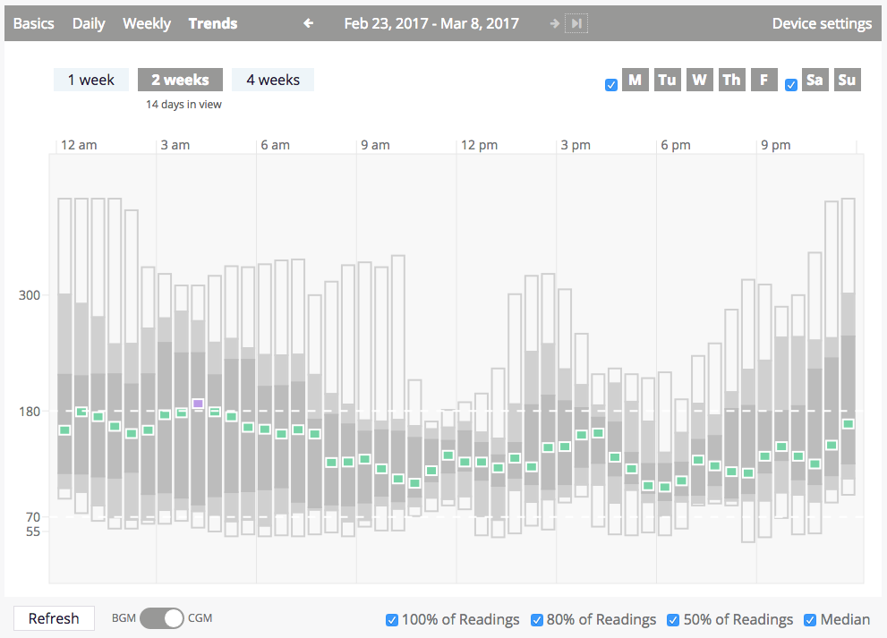
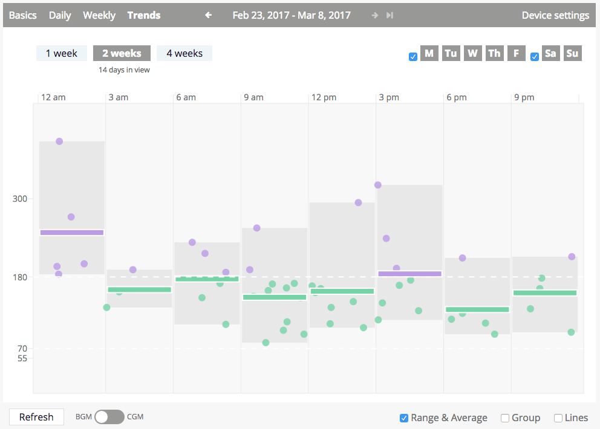
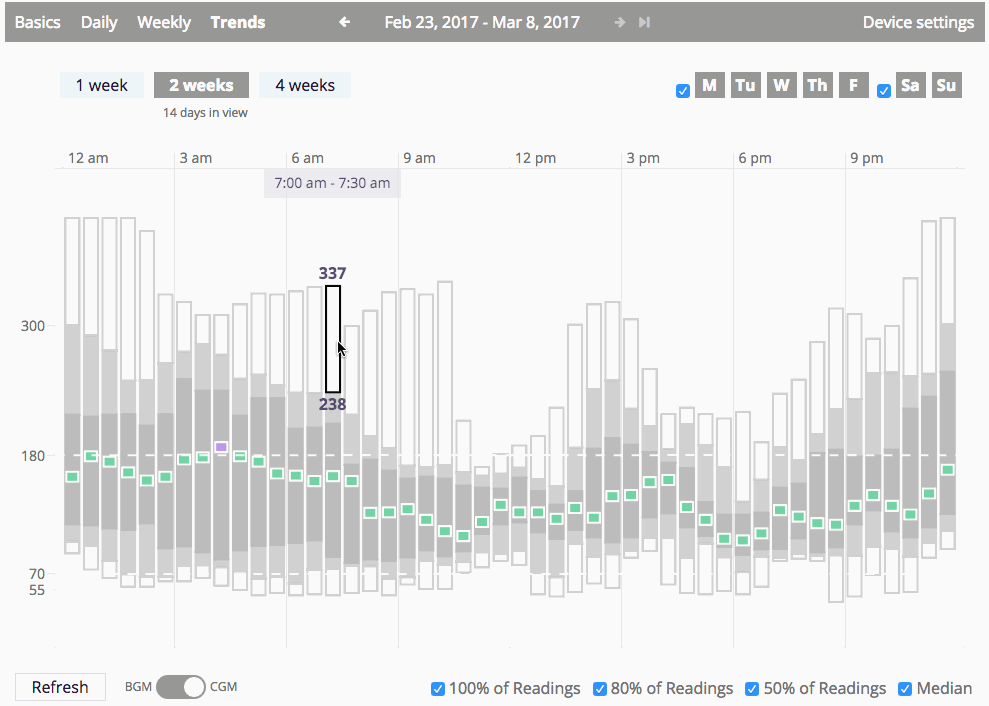
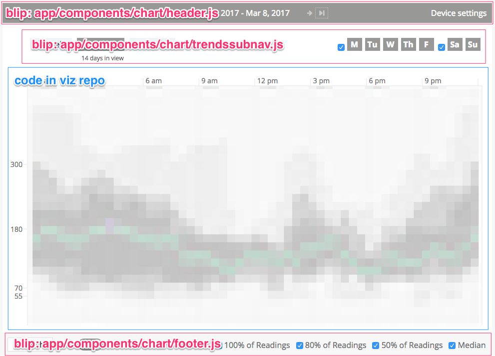

## Trends view

Table of contents:

- [user experience](#user-experience)
- [architecture](#architecture)
    + [component hierarchy](#component-hierarchy)
- [layout](#layout)
- [tech debt](#tech-debt)

### 👱🏾 User experience

There are two versions of the Trends view, one for displaying trend information based on fingerstick blood glucose data and the other for displaying trend information based on CGM data. The BGM version was developed first, and the CGM version is a more recent addition. A 14-day span of data is the default for this view, although the user can toggle to 7 days or 28 days using selectors displayed in the upper left corner of the display. (In the upper right of the display, the user can toggle days of the week such as Monday, Tuesday, etc. or weekdays vs. weekends off and on.) Both the CGM and CGM versions group all data in the selected span of time by time of day in an effort to show how blood glucose varies for the PwD by time of day. On the BGM version where the data is quite sparse, the data is grouped into three-hour "bins," and on the CGM version thirty-minute bins are used.

**CGM Trends as of March, 2017**




**BGM Trends as of March, 2017**



Like on the Daily view, hovering over various items in the display will produce a tooltip with more information. In addition, hovering on a segment of a time slice on the CGM version will expose all of the CGM daily sensor traces that intersect with that segment after a short delay (i.e., the pointer must remain on the same segment for a threshold of milliseconds before the exposure of traces is triggered).

**BGM Date Line Hover**


**BGM Individual `smbg` Hover**


**BGM Range Box Hover**


**CGM Segment Hover**



**CGM Segment Hover + Hold**


**CGM Segment Hover + Hold on `cbg`**


### 🏛️ Architecture

Currently only the data visualization itself for the BGM and CGM versions of the Trends view are implemented in this repository: code in blip is still being used for the 7, 14, and 28 days domain size selectors, the day of the week selectors, and of course the visualization sub-header that provides navigation between the views and along the datetime dimension. This makes the interface(s) between the blip and viz code a bit messier than they should be.



#### Component hierarchy

**CGM Trends**

```
└── PatientData (Redux-connected)
    └── Trends
        ├── TidelineHeader
        ├── TrendsSubNav
        ├── <div className="patient-data-content">
        │   ├── <div id="tidelineContainer">
        │   │   └── TrendsContainer
        │   │       └── TrendsSVGContainer (wrapped in DimensionsHOC)
        │   │           ├── Background
        │   │           ├── XAxisLabels
        │   │           ├── XAxisTicks
        │   │           ├── YAxisLabels
        │   │           ├── <g id="cbgTrends">
        │   │           │   ├── CBGSlicesContainer
        │   │           │   │   └── <g id="cbgSlices">{48 CBGSliceAnimated, each wrapped in WithDefault HOC}</g>
        │   │           │   └── CBGDateTracesAnimationContainer
        │   │           │       └── ReactTransitionGroupPlus
        │   │           │           └── <g id="cbgDateTraces">{n CBGDateTraceAnimated where n is number of exposed CGM sensor traces}</g>
        │   │           └── TargetRangeLines
        │   ├── CBGDateTraceLabel
        │   └── FocusedRangeLabels
        └── TidelineFooter
```

**BGM Trends**

```
└── PatientData (Redux-connected)
    └── Trends
        ├── TidelineHeader
        ├── TrendsSubNav
        ├── <div className="patient-data-content">
        │   ├── <div id="tidelineContainer">
        │   │   └── TrendsContainer
        │   │       └── TrendsSVGContainer (wrapped in DimensionsHOC)
        │   │           ├── Background
        │   │           ├── XAxisLabels
        │   │           ├── XAxisTicks
        │   │           ├── YAxisLabels
        │   │           ├── <g id="">
        │   │           │   ├── 
        │   │           │   │   └── 
        │   │           │   └── 
        │   │           │       └── 
        │   │           │           └── <g id="">
        │   │           └── TargetRangeLines
        │   └── FocusedRangeLabels
        └── TidelineFooter
```

### 📐 Layout

### 💣 Tech Debt

- Because of where they need to be rendered in the component hierarchy, the hover tooltip component(s) are currently being rendered in blip, and so as an expedient way to share the hover state between the viz code and the blip code, we are using Redux actions to represent the hover focus on element(s). Since hover state is **not** the kind of state that it makes sense to persist when a user navigates away from the visualization part of the app before coming back, the Redux store is not the appropriate place to store this state. Rather, this state should probably be contained in the React component state of a high-level container component in Trends.